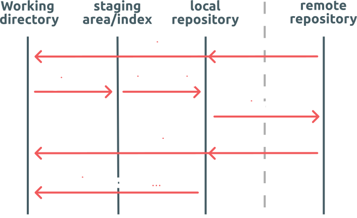

# git-101

This repository contains slides presenting git and github workflow.
They were made in markdown using [marp](https://marp.app).

The PDF is available on the release page or [here](https://github.com/Nanoseb/git-101/releases/download/v1.0/slides.pdf).

## Git workflow

## I am lost, what can I do?

* `git status`: to see what's going on
* `git help ...`: to have detailed help pages
* `git reset ...`: to go back in time
* `git diff ...`: to see the changes made
* `git log ...`: to view the history, in particular:
* `git log --reflog --oneline --graph`: to see the entire repository tree
* read error messages
* google(!)

## Useful links

* Interactive cheatsheet:
  * https://ndpsoftware.com/git-cheatsheet.html
* Visualise and play with branches:
  * https://git-school.github.io/visualizing-git
* Escape from a mess:
  * http://justinhileman.info/article/git-pretty/git-pretty.png
* Official git documentation:
  * https://git-scm.com/doc

