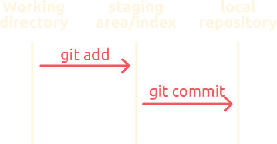
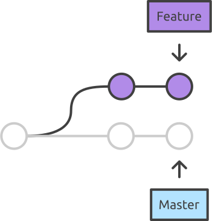
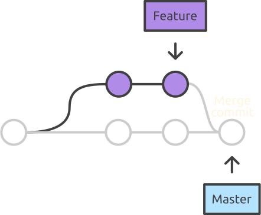
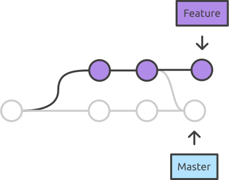
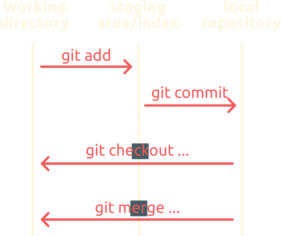
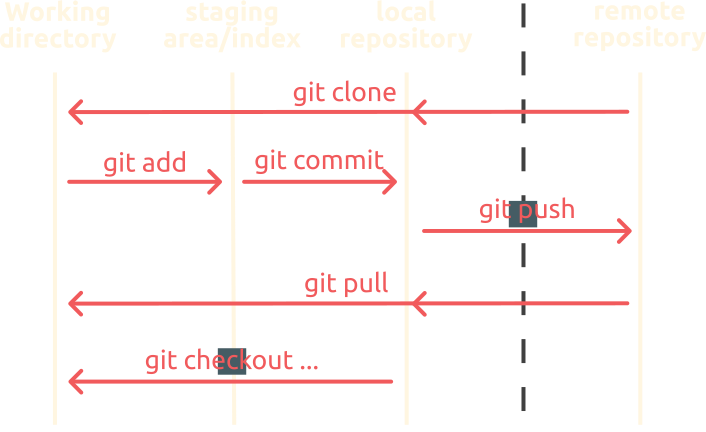
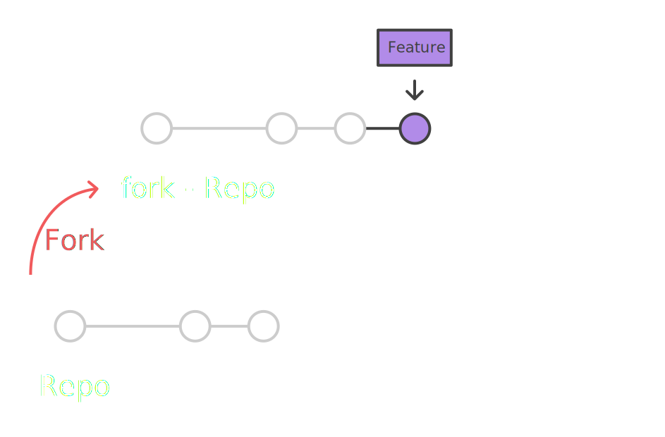
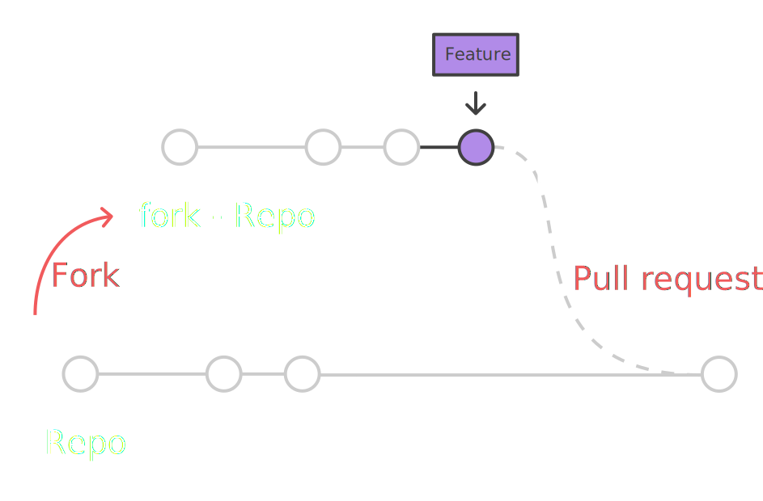

<!-- _class: "lead invert" -->
<style>
img[alt~="center"] {
  display: block;
  margin: 0 auto;
}
img[alt~="right"] {
  float: right;
}
img[alt~="left"] {
  float: left;
  margin: 0 auto;
}
</style>

<!-- # **Git** -->


how to avoid Getting In Trouble?

Sébastien Lemaire
<sebastien.lemaire@soton.ac.uk>


---
<!-- _class: lead -->

# Introduction
### Version control?

---
# What is version control?

It is a tool to

* record file **modifications** over time, allowing *time travel*

* help **collaboration** and code sharing

* help **traceability** (to blame the right person when something goes wrong)

---
# Git
It is a version control system: 
* Open source
* First developed by *Linus Torvalds*
* Used by more than 85% of open source projects
* Very fast and scalable (initially developed for the Linux kernel)
* Can work fully offline
* Many tools and online services available
* ...

---
<!-- _class: lead -->

# Git basics
Making changes to a local repository

---
# Repository

It is a folder containing an entire project, it includes:

* An history tree composed of **commits**
* Several **branches**
* Reference to a remote server

Git commands can interact with it.

---

# Commit

It is a snapshot of the folder/file structure of the project, it includes:

* A time stamp: `Fri Mar 14 15:09:26 2020 +0100`
* An author: `John Doe <jd@abc.com>`
* A message: `First implementation of feature X`
* A unique identifier: `babb6f7...`
* The state of the files at a particular moment


---
# Workflow for creating a commit
* **Staging area or Index**: area used to prepare a commit
* `git add fileA fileB ...`: put fileA and fileB in the **staging area**
* `git commit`: Create a commit from files in the staging area and store it in the local repository




---

# Commit guidelines
* only commit **source** files, not results
* Avoid commiting binary files
* Commit often: one feature/thing per commit, not *once a day*
* Explicit and informative commit messages
* Explain why and what in the commit messages:
```markdown
Fix memory leak on restart

Why was this change needed? What does it do?
No need to explain "How does it do it?", the source is there for that
```

---
<!-- _class: gaia lead -->

# Let's play

* initialise a repository `git init`
* create some files
* commit changes `git add ...; git commit ...`
* see the log `git log`
* ...

---

<!-- _class: lead -->

# Git branching


---
# What is a Branch?

* A repository is a tree where each commit has a parent
* Branches are used to separate new development from the main one
* A branch is really just a pointer to a commit: **cheap** to create

* [HEAD] is a pointer to the current location in the tree

---
# Merge different Branches

This is done to synchronise different branches, it leads to a merge commit
* Merge the master back to a branch to update it
* Merge a branch to the master branch
* Synchronise two separate branches

This can lead to conflicts, but often automatically/easily resolved

---
# Merge different Branches

This is done to synchronise different branches, it leads to a merge commit
* Merge the master back to a branch to update it
* Merge a branch to the master branch
* Synchronise two separate branches

This can lead to conflicts, but often automatically/easily resolved

---
# When to use branches?

* **master** or **main** branch is the default one: stable version of the software
* Use new branches:
  * To develop a new feature
  * For experimental work
  * To quickly test something without messing up *master*

With git, branches are cheap and easy to merge back: **don't hesitate to use them**


---
# Workflow with branches

* `git checkout -b branchname`: create a new branch called branchname and switch to it
* `git checkout branchname`: switch to branchname (changes working directory inplace)

* `git merge branchname`: merges branchname into the current branch

---
<!-- _class: gaia lead -->

# Let's play

* create a new branch
* commit changes to it
* merge it back to master

https://git-school.github.io/visualizing-git/
https://ndpsoftware.com/git-cheatsheet.html

---
<!-- _class: lead -->

# Git with a remote server
Github / Gitlab / ...


---

# Why a remote server? 
Git itself doesn't need any central server. Any repository can be used as a *server*.
Though 'cloud' remote servers allow:
* easily code sharing
* collaboration workflows (fork, pull requests/merge requests)
* repository preview
* Association of other tools like: Issue tracking system, Wiki, Continuous integration...

---
# Workflow with a remote server




---
# Workflow with a remote server

* `git clone <repo>`: Download the repository <repo>
* `git push`: Update the server with local commits
* `git pull`: Incorporate changes from repote repository to local one

This workflow is general to any remote server.


---
<!-- _class: gaia lead -->

# Let's play

* create a repository on github
* set it up locally
* make edits, commit them and push

https://github.com/nanoseb/git-101

---
# Github workflow

Each user can have several repositories, either private or public

* `fork`: creates a copy of some one else repository in your space.
* `pull request` (github), `merge request` (gitlab): ask someone else to review your changes (from your fork) and merge them in his repository

---
# Github contribution workflow


---
# Github contribution workflow



---
# Github contribution workflow



---
# Github contribution workflow
In short, the different steps to contribute to someone else repository:

* `fork` on github (**website**)
* `clone` your fork locally (`git clone ...`)
* edit your fork and commit your changes
* `push` your commits
* create `pull request` (**website**)

https://guides.github.com/introduction/flow
https://guides.github.com/activities/forking

---
# Pull request workflow

* Allows contribution to a repository you don't have permissions to.

* Allows code review and checks.

Pull requests can also be used for repositories you have write access to:
* create a new branch
* make your edits in the new branch
* create `pull request` (**website**)

---
<!-- _class: gaia lead -->

# Let's play

* look at github UI for fork and PR

---
<!-- _class: lead -->
# Aditional features
.gitignore / tig / git log / github tricks

---
# .gitignore

`.gitignore` file is a text file specifying files pattern that should be ignored. It prevents mistakes and repository clutter.
For example:
```
# Fortran
*.mod
*.o

# Python
*.pyc
```
This file need to be committed like any file of the repository.

---
# tig
https://jonas.github.io/tig/

A text based GUI for git.
* Interactive tree view
* Show detailed logs

---

# Github tricks

* use `#17` or any number to reference an *issue* or a *pull request* in a commit message
  * close issue with `fix #17` or `close #17` in commit message

* Some files can be visualised directly on the website:
  * .md, .pdf, any images but also .stl and jupyter notebook 

* Look at the contribution graph to see if a repository is dead or not
    

---
<!-- _class: gaia lead -->

# Let's play

* add a `.gitignore` and commit it
* play with `tig`
* look at github gui

https://github.com/nanoseb/git-101

---
# Installation

* Linux: just use your package manager to install git

* Windows:
  * Install **git bash**: https://gitforwindows.org


some GUI available, but be careful:
* they limit the possibilities
* they sometimes change the usual git nomenclature
* and you can end up not understanding what you are doing

---

# Authentication on github

* username/password → deprecated and will be removed soon

* with public keys: 
  * https://docs.github.com/en/free-pro-team@latest/github/authenticating-to-github/connecting-to-github-with-ssh

* With a Personal Access Token:
  * https://docs.github.com/en/free-pro-team@latest/github/authenticating-to-github/creating-a-personal-access-token

---
# I am lost, what can I do?


* `git ... help`: detailed help pages
* `git status`: to see what's going on
* `git log ...`: to view the history
* `git reset ...`: to go back in time 
* `git diff ...`: to see the changes made
* read error messages
* google(!)

All in all, it is **very** hard to loose any data

---

# Useful links

* Interactive cheatsheet:
  * https://ndpsoftware.com/git-cheatsheet.html
* Visualise and play with branches:
  * https://git-school.github.io/visualizing-git
* Escape from a mess:
  * http://justinhileman.info/article/git-pretty/git-pretty.png
* Official git documentation:
  * https://git-scm.com/doc

---
<!-- _class: gaia lead -->

# Your turn

